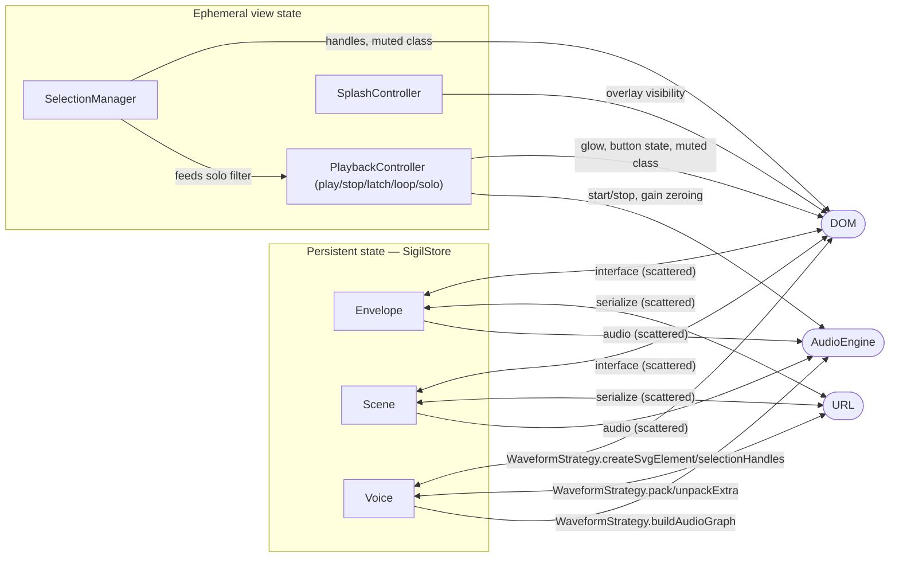

# Waveform Strategy Refactor

## Context

Spatch has three waveform types — **sine** (circle), **pulse** (square), **blend** (triangle) —
each with distinct audio behaviour, visual geometry, and interaction rules. Before this
refactor, per-waveform logic was scattered across the codebase in a chain of `switch`
statements and `if (waveform !== 'sine')` guards: the renderer built its own resize handles,
`shapes.ts` tested `'timbre' in voice` to decide whether to rotate, `harmony.ts` checked the
waveform name to decide whether timbre applied, and `serialize.ts` wrapped timbre packing in a
`strategy.hasTimbre` guard.

The root cause was a shallow application of the strategy pattern. A `WaveformStrategy`
interface existed, but callers kept reaching past it to make per-waveform decisions
themselves. This also caused a circular dependency: the strategy files imported `vibe.ts` to
access `warmth`, forcing `vibe.ts` to import the strategies, completing the cycle.

---

## Design principle

> **"The only thing the renderer knows that the voices don't know is their positions and where
> they overlap. Everything else belongs to the strategy."**

Strategies are the canonical owners of all per-waveform behaviour. Every module that works
with a voice dispatches *into* the strategy; it does not inspect the voice type itself.

A natural follow-on separation — splitting a voice into distinct audio and visual classes —
is deferred until a voice actually accrues too much responsibility. We establish the owner
boundary now; we refactor the object graph later if needed.

---

## Changes

### 1. Break the circular dependency (`node-utils.ts`)

`vibe.ts` ↔ `waveforms/` was a compile-time cycle. It was broken by extracting a small
pure-audio utilities module, `audio/node-utils.ts`, which has no imports from either `vibe`
or `waveforms/`. Strategy files now import from `node-utils.ts`. The `warmth` value they
previously pulled from `vibe` at build time is threaded through `AudioSharedNodes` by
`voice-builder.ts` instead.

### 2. `gainExponent` on the strategy

The loudness power-curve exponent (`gainExponent`) was stored in `VIBE_DEFAULTS.exponents`,
an object keyed by waveform name. The gain table was built by iterating those keys — hardcoded
waveform enumeration. Moving `gainExponent` onto the strategy object means the full gain table
is now constructed by iterating `ALL_STRATEGIES`. Adding a fourth waveform requires no changes
to `vibe.ts`.

### 3. `selectionHandles(voice): SVGElement[]` replaces `handlePositions` + renderer handle code

Previously `WaveformStrategy.handlePositions` returned a list of `[HandleType, x, y]` tuples,
and `render.ts` used `HANDLE_SIZE` / `ROT_HANDLE_OFFSET` constants to construct `<rect>` and
`<circle>` elements for each tuple. The rotation handle (stem + circle) was a separate block
inside `renderVoiceSelection`, conditionally emitted only when `strategy.hasTimbre` was true.

Now each strategy implements `selectionHandles(voice): SVGElement[]`, returning fully-formed
SVG elements with `data-handle` attributes already set. The renderer simply appends them. The
factories (`resizeHandleEl`, `rotationHandleEls`) live in `dom.ts` as shared helpers; the
constants (`HANDLE_SIZE`, `ROT_HANDLE_OFFSET`) live there too so strategies can produce
correctly-sized handles without knowing renderer internals.

| Strategy | Handles returned |
|----------|-----------------|
| `sine`   | 4 cardinal resize squares (N, E, S, W) |
| `pulse`  | 4 corner resize squares (NW, NE, SE, SW) + rotation stem+circle |
| `blend`  | 3 vertex resize squares (N, SE, SW) + rotation stem+circle |

### 4. `getTimbre` / `withTimbre` eliminate `'timbre' in voice` guards

Rather than testing for the `timbre` property at callsites, callers delegate to the strategy:

- `getTimbre(voice): NormalizedCoord` — returns the voice's current timbre as a normalized
  value (0–1). No-ops return `0` for sine.
- `withTimbre(value): Partial<Voice>` — returns a partial voice update applying timbre. No-ops
  return `{}` for sine, making the update harmless to apply unconditionally.

`shapes.ts`'s `voiceRotation` switches from `'timbre' in voice` to
`getStrategy(voice.waveform).getTimbre(voice)`. `harmony.ts`'s `randomize` switches from
`waveform !== 'sine'` to `strategy.withTimbre(normalizedCoord(Math.random()))`, which is a
no-op for sine and correct for everything else.

### 5. `unpackExtra` unconditionally called in `serialize.ts`

The `if (strategy.hasTimbre)` guard around `unpackExtra` was redundant: sine's
`unpackExtra` already returns `{ fields: {}, bytesRead: 0 }`, so calling it unconditionally
is safe and eliminates the last waveform-type check from the deserializer. The stale comment
noting the `hasTimbre == serializationIndex > 0` assumption is removed along with the guard.

### 6. `shapeAreaCoeff` on the strategy

`Vibe.shapeAreaFraction()` previously had a hardcoded switch statement over waveform names.
It is now a single expression:

```ts
strategy.shapeAreaCoeff * half * half
```

The geometric area coefficients (`π` for circle, `4` for square, `3√3/4` for triangle) are
properties of the strategy objects, not of the audio engine.

---

## Ownership table

| Concern | Owner after refactor |
|---------|---------------------|
| SVG shape element (create/update) | `WaveformStrategy` |
| Selection handle elements | `WaveformStrategy` via `selectionHandles` |
| Handle element construction helpers | `dom.ts` (`resizeHandleEl`, `rotationHandleEls`) |
| Visual rotation (degrees) | `shapes.ts` `voiceRotation`, reading `getTimbre` |
| Rotation transform in render | `render.ts` (reads `voiceRotation`) |
| Timbre read | `WaveformStrategy.getTimbre` |
| Timbre write (partial update) | `WaveformStrategy.withTimbre` |
| Audio graph construction | `WaveformStrategy.buildAudioGraph` |
| Shared audio scaffolding | `voice-builder.ts` + `AudioSharedNodes` |
| Warmth value at audio build time | `AudioSharedNodes.warmth` (set by `voice-builder`) |
| Gain exponent | `WaveformStrategy.gainExponent` |
| Area coefficient | `WaveformStrategy.shapeAreaCoeff` |
| Serialization extra bytes | `WaveformStrategy.packExtra` / `unpackExtra` |
| Voice creation (default state) | `WaveformStrategy.createVoice` |
| Randomize timbre | `harmony.ts` via `strategy.withTimbre` |

---

## Entity relationships

`SigilStore` is the single source of truth for persistent state. It contains three
domains — **Envelope**, **Scene/Vibe**, and **Voices** — each projected in three directions:

- **Audio** (one-way →): state drives audio engine parameters
- **Serializer** (two-way ↔): state is packed/unpacked to/from the URL
- **Interface** (two-way ↔): state is rendered to DOM; user input is written back

`WaveformStrategy` is the clearest realization of this pattern: it is simultaneously
the audio delegate (`buildAudioGraph`, `updateParams`), the serializer delegate
(`packExtra`/`unpackExtra`), and the interface delegate (`createSvgElement`,
`selectionHandles`, `getTimbre`/`withTimbre`) for the Voice domain. The refactor
completed here makes that unified ownership explicit.

Envelope and Scene/Vibe follow the same logical structure but their delegate
responsibilities are currently scattered — Envelope audio lives in `engine.ts`,
Envelope serialization is inline in `serialize.ts`, and so on. Consolidating
them to match the Voice pattern is the natural next step.

**Ephemeral view state** sits alongside `SigilStore` as a second, non-persistent
layer. `PlaybackController` (play/stop/latch/loop/solo), `SelectionManager` (selected
voice ID), and `SplashController` (splash/landscape overlay) all drive audio and
DOM but are never serialized. They project in two directions only:

- **Audio** (one-way →): `PlaybackController` starts/stops the engine and zeroes
  gain on non-selected voices when solo is active; `SelectionManager` feeds the
  solo filter as an input to `PlaybackController`
- **Interface** (one-way →): playback state drives canvas glow and play button
  appearance; selection drives marching-ants UI and muted CSS class

User input writes directly into view state (not through `SigilStore`), which then
projects outward. There is no serializer path and no undo history for view state.

**Continuous gestures.** Drag/resize/rotate updates call both the store and the
audio delegate as explicit siblings in the same handler:

```
pointerMove -> store.updateVoice(id, delta)                     // source of truth
            -> audioVoice.updateParams(voice, ctx.currentTime)  // audio delegate
```

This is the correct model, not a bypass of it. Audio param scheduling requires
`ctx.currentTime` captured at call site; a subscription would cross a microtask
boundary and invalidate the timestamp. The render path is handled by the RAF loop
reading store state once per frame — no subscription needed there either.



A full ER diagram of the current implementation is at
[`docs/waveform-strategy-er.svg`](waveform-strategy-er.svg).
